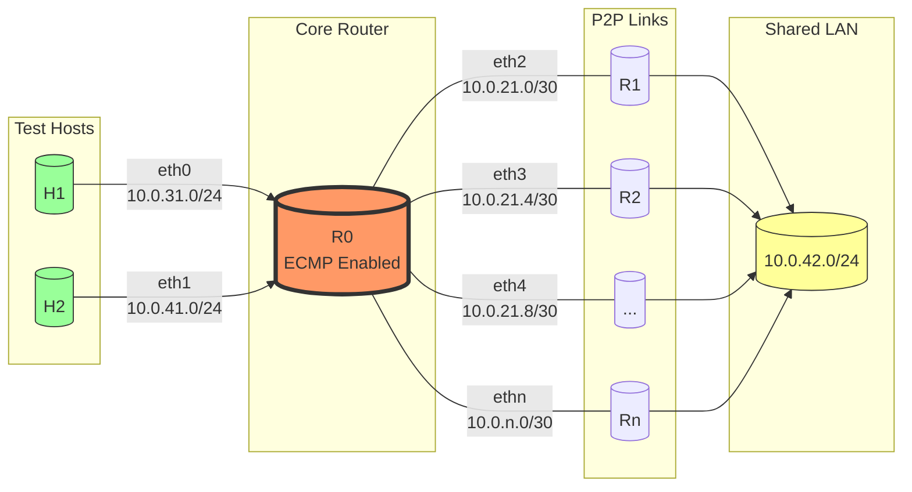

# Разработка методики тестирования ECMP Hash

## Цель задачи

Разработать методику тестирования, которая позволит проверить, что при настройке hash-алгоритма только на Source IP адрес, трафик с разными Source IP адресами корректно распределяется по доступным ECMP путям.

### Среда тестирования

Для выполнения задачи используется среда виртуальных сетей netlab. В netlab запускается виртуальная топология из нескольких маршрутизаторов и linux-хостов, которые запускаются в контейнеризированном исполнении через оркестратор containerlab.

Тестовая топология представлена на следующем изображении:

Скрипт запуска принимает на вход параметр N - количество исходящих линков (маршрутизаторов Rn).
Использованные контейнерные образы:
| Узел топологии | Образ |
| -------- | ------- |
| R0, R1 .. Rn  | frr    |
| H1, H2 | python:3-trixie     |

### Предварительные настройки
Хосты H1 и H2 подключены к отдельным портам маршрутизатора R0, адресация на линках - 10.0.31.0/24 и 10.0.41.0/24. Между R0 и остальными маршрутизаторами настраиваются p2p-линки с /30-подсетями, взятыми из сети 10.0.21.0/24. Маршрутизаторы R1..Rn также подключены к общей LAN-сети 10.0.42.0/24.</br>
Между маршрутизаторами поднимается OSPF-соседство для обмена маршрутами.</br>
На R0 применяются настройки для расчета ECMP-hash только по source IP address:
```
sysctl -w net.ipv4.fib_multipath_hash_fields=0x0001
sysctl -w net.ipv4.fib_multipath_hash_policy=3
```
### Генерация тестового трафика
#### Тест A
Для проверки работы ECMP запускается генерация пакетов на хостах H1 и H2 для проверки влияния входящего интерфейса на выбор nexthop.
Тестовый трафик генерируется python-скриптом. В таблице перечислены парамерты тестовых пакетов:
| Параметр | Значение |
| ------ | ------ |
| Source IP | 10.1.1.[1-n] |
| Destination IP | 10.0.42.[4-7] |
| Source Port | 4001-4004 |
| Destination Port | 5001-5004 |
| Protocol | TCP, UDP |

Проводится серия из N тестов (по числу линков R0-Rn) . В каждом тесте трафик запускается с фиксированного source IP, начиная от 10.1.1.1 и заканчивая 10.1.1.n.</br>
В каждом тесте параметры пакетов изменяются в соответствии с таблицей, приведенной выше. 

#### Тест Б
На H1 запускается скрипт, генерирующий пакеты со следующими параметрами:
| Параметр | Значение |
| ------ | ------ |
| Source IP | Случайный |
| Destination IP | Случайный из сети 10.0.42.0/24 |
| Source Port | Случайный из диапазона 1024-65536 |
| Destination Port | Случайный из диапазона 1024-65536 |
| Protocol | TCP |

Скрипт принимает на вход количество пакетов для генерации.

### Методика захвата трафика
Запускается захват трафика на каждом p2p-интерфейсе маршрутизатора R0, таким образом будет проанализирован трафик  на исходящих интерфейсах.</br>
Захватываемый трафик фильтруется по source IP - собирается только трафик с IP 10.1.1.n, где n - текущий номер теста.
Файлы дампов трафика записываются в директорию tests/captures.</br>
При проведении теста А для каждого отдельного линка создается файл с именем вида lps_test{i}_link{j}.pcap, где i - номер теста, j - номер линка.</br>
При проведении теста Б для каждого линка создается файл с именем rps_linkP{i}.pcap, где i - номер линка.

### Анализ результатов
Для оценки корректности работы ECMP с вычислением hash по source IP address используем следущие критерии.</br>
Для теста А:
- в каждом отдельном тесте трафик присутствует только на одном линке
- по результатам всех N тестов на всех линках зафиксирован трафик - не подтверждается из-за hash-поляризации.</br>

Для теста Б:
- равномерное (с заданой точностью) распределение пакетов по исходящим линкам

### Подготовка среды, установка компонентов
Установка netlab, containerlab:
```
sudo apt-get update && sudo apt-get install -y python3-pip tcpdump
sudo python3 -m pip install networklab pytest scapy allure-pytest numpy matplotlib seaborn --break-system-packages
sudo netlab install ubuntu ansible containerlab
```
Установка allure:
```
sudo apt-get install ca-certificates-java  default-jre-headless  java-common  openjdk-21-jre-headless
cd /tmp
wget https://github.com/allure-framework/allure2/releases/download/2.38.1/allure_2.38.1-1_all.deb
sudo dpkg -i allure_2.38.1-1_all.deb
```

### Запуск

При запуске скрипта необходимо указать n - количество линков в тестовой топологии:
```
./script.sh n
```